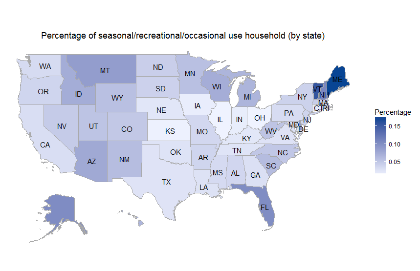
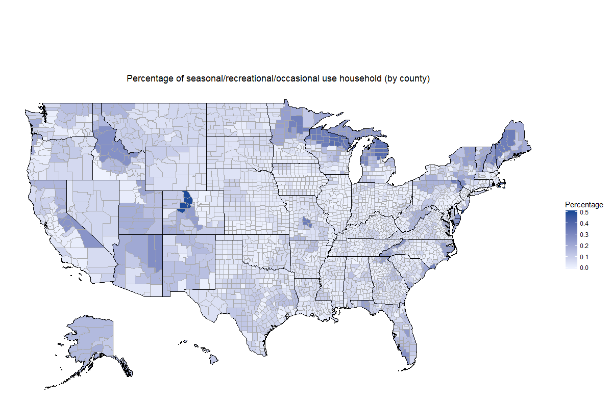
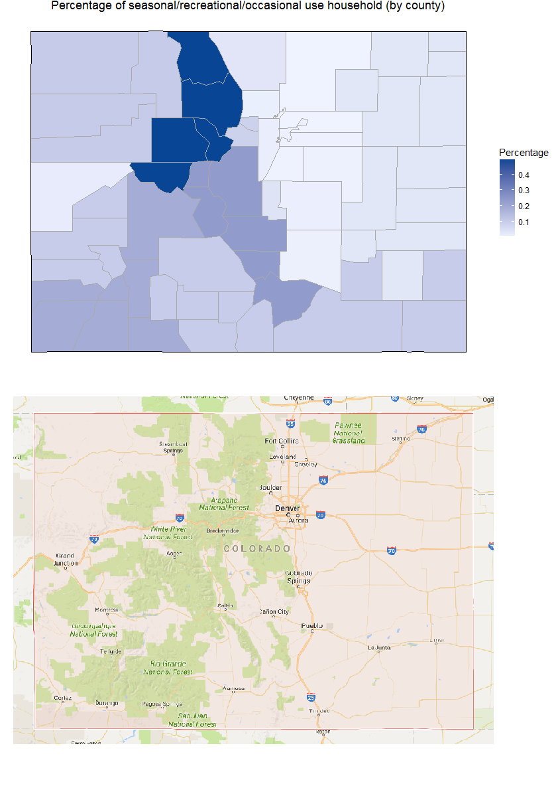

# Project: American Community Surveys (2013 and 2014)
### [Project Description](doc/Project1_desc.md)
#
Term: Fall 2016

+ Project title: Where are the houses of seasonal/recreational/occasional use?
+ Members
	+ Yinxiang Gao

+ Project summary: In this project, we focus on the seasonal/recreational/occasional use households, trying to discover the possible relationship between their geographical location and the location of famous sights (national parks and forests).

